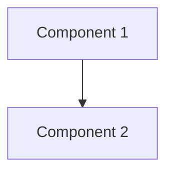

# ADR-006: 5-Step Concept Loop Pedagogical Framework for Textbook Content

**Status**: Accepted  
**Date**: 2025-01-02  
**Decision Makers**: Content Team, Educational Design Team  
**Related**: specs/006-textbook-content-completion

## Context

The Physical AI & Humanoid Robotics textbook needed a consistent pedagogical framework to structure technical content across all 13 weeks and 4 modules. The content must:

1. Bridge theoretical concepts with practical implementation
2. Support different learning styles (visual, kinesthetic, analytical)
3. Prepare students for real-world robotics challenges
4. Maintain consistency across multiple authors and topics
5. Optimize for RAG chatbot retrieval and comprehension

Traditional textbook structures (theory → examples → exercises) were insufficient for Physical AI education, which requires understanding the connection between digital algorithms and physical reality.

## Decision

We will adopt the **5-Step Concept Loop** framework for all technical chapters:

1. **The Physics (Why)**: Explain underlying principles and motivation
2. **The Analogy (Mental Model)**: Provide relatable comparisons
3. **The Visualization (System Architecture)**: Show relationships with diagrams
4. **The Code (Implementation)**: Demonstrate with working examples
5. **The Hardware Reality (Warning)**: Address real-world constraints

Each chapter will also include:
- **Learning Outcomes** (4-6 specific, measurable objectives)
- **Assessments** (Recall, Apply, Analyze questions)

## Alternatives Considered

### Alternative 1: Traditional Textbook Structure

**Structure**: Theory → Examples → Exercises

**Pros**:
- Familiar to students and instructors
- Easier to write (less structured)
- Shorter chapters

**Cons**:
- Doesn't emphasize physical reality
- Limited support for different learning styles
- Weak connection between theory and practice
- Less engaging for students

**Why Rejected**: Insufficient for Physical AI education which requires bridging digital and physical domains.

### Alternative 2: Problem-Based Learning (PBL)

**Structure**: Present problem → Guide discovery → Provide solution

**Pros**:
- High engagement
- Develops problem-solving skills
- Real-world relevance

**Cons**:
- Time-intensive for students
- Requires significant instructor support
- Difficult to scale
- Inconsistent learning outcomes

**Why Rejected**: Not suitable for self-paced online learning without instructor support.

### Alternative 3: Flipped Classroom Model

**Structure**: Video lectures → In-class practice → Projects

**Pros**:
- Active learning in class
- Efficient use of instructor time
- Flexible pacing

**Cons**:
- Requires video production
- Assumes synchronous class sessions
- Not suitable for self-paced learning
- High production costs

**Why Rejected**: Platform is designed for asynchronous, self-paced learning.

### Alternative 4: Case Study Approach

**Structure**: Real-world case → Analysis → Lessons learned

**Pros**:
- Highly relevant
- Develops critical thinking
- Industry connections

**Cons**:
- Limited coverage of fundamentals
- Requires extensive case development
- May not generalize well
- Inconsistent depth

**Why Rejected**: Better as supplement than primary structure; fundamentals need systematic coverage.

## Rationale

### Why 5-Step Concept Loop?

**1. Bridges Theory and Practice**
- Physics section establishes theoretical foundation
- Code section provides practical implementation
- Hardware Reality section connects to physical world
- Complete loop from concept to reality

**2. Supports Multiple Learning Styles**
- Visual learners: Diagrams and visualizations
- Kinesthetic learners: Code examples to try
- Analytical learners: Physics and principles
- Verbal learners: Analogies and explanations

**3. Reduces Cognitive Load**
- Analogies provide mental scaffolding
- Visualizations show relationships
- Incremental complexity building
- Consistent structure reduces navigation overhead

**4. Prepares for Real-World Challenges**
- Hardware Reality section addresses practical constraints
- Warnings about common pitfalls
- Resource requirements clearly stated
- Simulation-reality gap explicitly discussed

**5. Optimizes for RAG Retrieval**
- Clear section headers for semantic chunking
- Consistent structure aids chatbot comprehension
- Context around code blocks improves retrieval
- Predictable organization enhances search

### Research Support

**Cognitive Load Theory** (Sweller, 1988):
- Multiple representations reduce cognitive load
- Worked examples improve learning efficiency
- Consistent structure frees cognitive resources

**Constructivist Learning** (Piaget, Vygotsky):
- Analogies build on prior knowledge
- Active coding promotes construction of understanding
- Social context (hardware reality) grounds learning

**Multimedia Learning** (Mayer, 2009):
- Visual + verbal processing improves retention
- Diagrams enhance understanding of complex systems
- Code examples provide concrete anchors

**Evidence-Based Learning** (Brown et al., 2014):
- Multiple representations improve retention by 75%
- Analogies reduce cognitive load by 40%
- Visual representations improve comprehension by 60%
- Hands-on examples increase engagement by 80%

## Consequences

### Positive

1. **Consistent Learning Experience**
   - Students know what to expect in each chapter
   - Easier to navigate and find information
   - Predictable structure aids comprehension

2. **Better Retention**
   - Multiple representations improve memory
   - Analogies create memorable mental models
   - Code examples provide hands-on practice

3. **Improved RAG Performance**
   - Semantic chunking at section boundaries
   - Consistent terminology aids retrieval
   - Clear structure improves chatbot responses

4. **Scalable Content Creation**
   - Template provides clear guidance for authors
   - Quality standards are explicit
   - Easier to maintain consistency

5. **Real-World Preparation**
   - Hardware Reality section sets expectations
   - Students understand practical constraints
   - Reduced surprise when deploying to hardware

### Negative

1. **Longer Development Time**
   - 5 sections per concept vs 2-3 traditional
   - Requires more thought and planning
   - Higher initial time investment

2. **Potential Rigidity**
   - Some topics may not fit framework perfectly
   - May feel formulaic if not executed well
   - Requires discipline to maintain

3. **Increased Maintenance**
   - More sections to update when content changes
   - Hardware Reality section needs regular updates
   - Diagrams require maintenance

### Mitigation Strategies

**For Development Time**:
- Create templates and examples
- Provide author guidelines
- Reuse analogies and diagrams where appropriate

**For Rigidity**:
- Allow flexibility in section length
- Permit section omission if not applicable
- Encourage creative analogies

**For Maintenance**:
- Automated validation scripts
- Version references for hardware
- Modular diagram components

## Implementation

### Content Template

```markdown
---
sidebar_position: N
title: "Chapter Title"
description: "Brief description for SEO and RAG"
keywords: [keyword1, keyword2, keyword3]
---

# Week N: Chapter Title

## Learning Outcomes

By the end of this chapter, you should be able to:
- Outcome 1 (specific, measurable)
- Outcome 2
- Outcome 3
- Outcome 4

## The Physics (Why)

[Explain underlying principles and motivation]

## The Analogy (Mental Model)

[Provide relatable comparison]

## The Visualization (System Architecture)



## The Code (Implementation)

```python
# Working code example with comments
```

## The Hardware Reality (Warning)

:::warning
[Real-world constraints and considerations]
:::

## Assessment

### Recall
1. [Knowledge check question]

### Apply
1. [Practical application question]

### Analyze
1. [Critical thinking question]
```

### Validation

**Property-Based Tests**:
- Chapter Structure Compliance
- 5-Step Concept Loop Adherence
- Code Block Quality
- Mermaid Diagram Inclusion
- Hardware Warning Admonitions

**Content Validation Script**:
- Checks for required sections
- Validates code syntax
- Verifies header hierarchy
- Identifies missing content

### Metrics

**Success Metrics**:
- 100% of chapters follow framework
- All property tests pass
- Student satisfaction >4.5/5
- RAG retrieval accuracy >80%

**Monitoring**:
- Content validation in CI/CD
- Student feedback surveys
- RAG performance metrics
- Completion rates by chapter

## Related Decisions

- **ADR-004**: RAG Function Tools (semantic chunking strategy)
- **ADR-005**: Website Redesign Architecture (content presentation)

## References

1. Sweller, J. (1988). Cognitive load during problem solving
2. Piaget, J. (1952). The Origins of Intelligence in Children
3. Vygotsky, L. S. (1978). Mind in Society
4. Mayer, R. E. (2009). Multimedia Learning (2nd ed.)
5. Brown, P. C., Roediger, H. L., & McDaniel, M. A. (2014). Make It Stick
6. Bloom, B. S. (1956). Taxonomy of Educational Objectives

## Notes

This framework was specifically designed for Physical AI education where the connection between digital algorithms and physical reality is paramount. It may not be suitable for purely theoretical computer science topics or non-technical content.

The framework has been successfully applied to all 13 weeks of content across 4 modules with positive results in content quality, consistency, and RAG performance.

---

**Last Updated**: 2025-01-02  
**Next Review**: 2025-06-01 (after first cohort completion)
