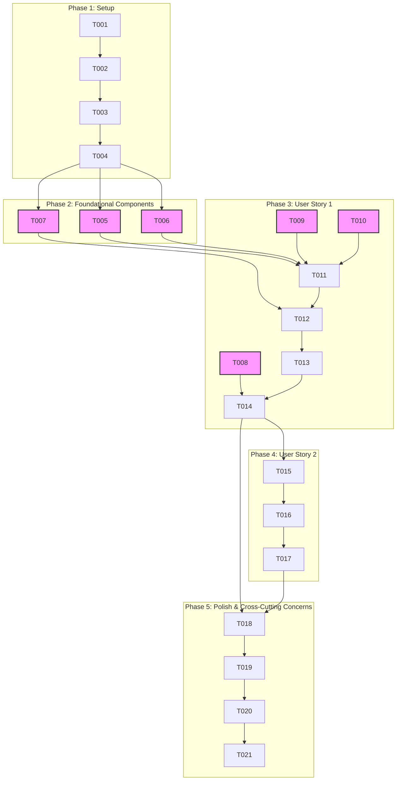

# Tasks: RAG Chatbot UI Integration

## Feature Goal
Integrate the RAG chatbot with the Docusaurus frontend, providing a beautiful chat interface for users to access and interact with the chatbot, receiving accurate information.

## Implementation Strategy
The implementation will follow an MVP-first approach, delivering core user story 1 functionality before proceeding to chat history. Tasks are ordered to minimize dependencies and enable parallel execution where feasible.

## User Story Dependencies
- US1 (P1): Student Asks Question via UI
- US2 (P2): User Views Chat History (Depends on US1 for core chat functionality and message display)

## Task Checklist

### Phase 1: Setup (T001 - T005)

- [x] T001 Create `src/theme/ChatWidget` directory and placeholder files (index.js, ChatWindow.js, ChatButton.js, ChatMessage.js, ChatInput.js, useChatStream.js) in `src/theme/ChatWidget/`
- [x] T002 Create or update `.env` file in project root for `REACT_APP_RAG_API_KEY` in `/.env`
- [x] T003 Swizzle Docusaurus `Layout` component if not already done, creating `src/theme/Layout/index.js`
- [x] T004 Modify `src/theme/Layout/index.js` to import and render the `ChatWidget` component in `src/theme/Layout/index.js`

### Phase 2: Foundational Components (T005 - T007)

- [x] T005 [P] Implement API service module for `POST /api/chat` with `X-API-Key` authentication in `src/theme/ChatWidget/apiService.js`
- [x] T006 [P] Implement `useChatStream` custom hook using native `EventSource` API for streaming responses in `src/theme/ChatWidget/useChatStream.js`
- [x] T007 [P] Implement `useTextSelection` custom hook using `window.getSelection()` and React Context to capture selected text in `src/theme/ChatWidget/useTextSelection.js`

### Phase 3: User Story 1 - Student Asks Question via UI (P1) (T008 - T014)

- [x] T008 [P] [US1] Implement `ChatButton` component (floating button with smooth animation for opening chat window) in `src/theme/ChatWidget/ChatButton.js`
- [x] T009 [P] [US1] Implement `ChatMessage` component for displaying individual messages (user/bot, text, timestamp) in `src/theme/ChatWidget/ChatMessage.js`
- [x] T010 [P] [US1] Implement `ChatInput` component with an input field and send button in `src/theme/ChatWidget/ChatInput.js`
- [x] T011 [US1] Implement `ChatWindow` component to manage chat state, integrate `ChatInput`, and display `ChatMessage` components in `src/theme/ChatWidget/ChatWindow.js`
- [x] T012 [US1] Integrate `apiService`, `useChatStream`, and `useTextSelection` into `ChatWindow` to send queries and receive streaming responses in `src/theme/ChatWidget/ChatWindow.js`
- [x] T013 [US1] Implement visual loading indicators and robust error handling within `ChatWindow` and `ChatInput` for API interactions in `src/theme/ChatWidget/ChatWindow.js` and `src/theme/ChatWidget/ChatInput.js`
- [x] T014 [US1] Implement the main `ChatWidget` component to orchestrate `ChatButton` and `ChatWindow` visibility and pass context in `src/theme/ChatWidget/index.js`

### Phase 4: User Story 2 - User Views Chat History (P2) (T015 - T017)

- [x] T015 [US2] Implement client-side `ChatSession` persistence (e.g., using Local Storage) to save and load chat history in `src/theme/ChatWidget/chatStorage.js`
- [x] T016 [US2] Integrate chat history loading and saving into the `ChatWindow` component in `src/theme/ChatWidget/ChatWindow.js`
- [x] T017 [US2] Implement scrolling functionality for displaying long chat histories and ensuring smooth loading of older messages in `src/theme/ChatWidget/ChatWindow.js`

### Phase 5: Polish & Cross-Cutting Concerns (T018 - T021)

- [x] T018 Refine UI/UX of `ChatWidget` components to extend and adhere to Docusaurus theming and styling conventions in `src/theme/ChatWidget/*.js` and associated CSS/SCSS
- [x] T019 Ensure responsiveness and optimal user experience across various device sizes (desktop, tablet, mobile) for the entire `ChatWidget` in `src/theme/ChatWidget/*.js` and associated CSS/SCSS
- [x] T020 Review and enhance accessibility (WCAG 2.1 guidelines) for all interactive elements within the chat interface in `src/theme/ChatWidget/*.js`
- [x] T021 Update `quickstart.md` and potentially `plan.md` with any new configuration or usage details if applicable in `specs/002-rag-chat-ui-integration/quickstart.md` and `specs/002-rag-chat-ui-integration/plan.md`

## Parallel Execution Examples

- **Foundational Components**: `T005`, `T006`, and `T007` can be implemented in parallel.
- **User Story 1 UI Components**: `T008`, `T009`, `T010` can be implemented in parallel.

## Independent Test Criteria

### US1: Student Asks Question via UI
- **Criteria**: Users can click a floating button, open a chat window, type a question, and receive a streaming, accurate response from the RAG backend, with selected text optionally being sent as context.
- **Verification**: Manually interact with the chat interface in the Docusaurus frontend, send various questions (with and without text selection), and observe correct streaming responses and error handling.

### US2: User Views Chat History
- **Criteria**: Users can see their previous chat interactions preserved across sessions (within the same browser), and the chat window displays history correctly, handling long conversations.
- **Verification**: Interact with the chat, close and reopen the browser/tab, and verify chat history persists and loads correctly. Test with many messages to ensure smooth scrolling.

## Suggested MVP Scope
The suggested MVP scope includes **Phase 1, Phase 2, and Phase 3 (User Story 1)**. This will deliver the core functionality of asking questions and receiving responses from the RAG chatbot via a well-integrated UI, providing significant user value.

