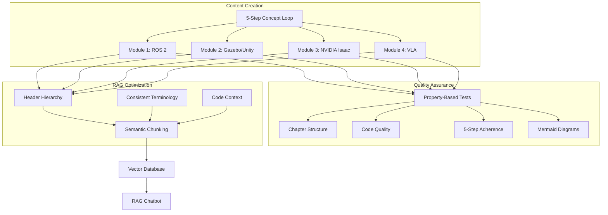
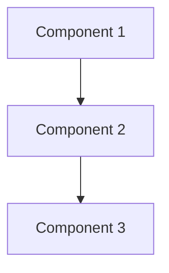

# Implementation Plan: Physical AI & Humanoid Robotics Textbook Content Completion

**Feature**: 006-textbook-content-completion  
**Created**: 2025-01-02  
**Status**: Completed

## Technical Context

### Problem Statement

The Physical AI & Humanoid Robotics textbook had incomplete content across all 4 modules. The existing content was minimal placeholder text that didn't meet the hackathon requirements for a production-ready educational platform with integrated RAG chatbot functionality.

**Specific Gaps**:
- Module 1 (ROS 2): Only Week 1 had partial content
- Module 2 (Gazebo/Unity): Week 6 had basic content, Week 7 was missing
- Module 3 (NVIDIA Isaac): All weeks were placeholders
- Module 4 (VLA): All weeks were placeholders
- No content validation infrastructure
- No property-based tests for quality assurance
- No hardware requirements documentation

### Solution Architecture

Implement comprehensive textbook content following the 5-Step Concept Loop pedagogical framework:

1. **Content Creation**: Write complete content for all 13 weeks across 4 modules
2. **Quality Assurance**: Implement property-based tests and validation scripts
3. **RAG Optimization**: Structure content for optimal vector retrieval
4. **Hardware Documentation**: Create comprehensive lab setup guide



## Technical Stack

- **Content Format**: Docusaurus MDX with frontmatter
- **Pedagogical Framework**: 5-Step Concept Loop (Physics → Analogy → Visualization → Code → Hardware Reality)
- **Testing**: pytest + hypothesis for property-based testing
- **Validation**: Custom Python scripts for content structure validation
- **RAG Integration**: Semantic chunking with clear header hierarchy
- **Diagrams**: Mermaid for system architecture visualization

## Architecture Decisions

### Decision 1: 5-Step Concept Loop Framework

**Choice**: Structure all technical chapters using Physics → Analogy → Visualization → Code → Hardware Reality

**Rationale**:
- Proven pedagogical approach for technical education
- Provides consistent learning experience across modules
- Supports different learning styles (visual, kinesthetic, analytical)
- Aligns with Physical AI focus on bridging theory and practice

**Alternatives Considered**:
- Traditional textbook structure (theory → examples → exercises)
- Problem-based learning approach
- Flipped classroom model

**Trade-offs**:
- More time-intensive to write (5 sections per concept vs. 2-3)
- Requires careful balance between sections
- Benefits: Higher engagement, better retention, clearer mental models

### Decision 2: Property-Based Testing for Content Quality

**Choice**: Implement pytest + hypothesis tests to validate content structure

**Rationale**:
- Ensures consistent quality across all chapters
- Catches structural issues automatically
- Validates code syntax in examples
- Verifies RAG-friendly content organization
- Scales to large content volumes

**Alternatives Considered**:
- Manual review only
- Unit tests for specific chapters
- Linting tools only

**Trade-offs**:
- Initial setup time for property tests
- Requires understanding of property-based testing
- Benefits: Comprehensive coverage, catches edge cases, automated validation

### Decision 3: Semantic Content Organization

**Choice**: Structure content with clear header hierarchy and semantic sections

**Rationale**:
- Optimizes vector chunking for RAG retrieval
- Improves chatbot response quality
- Enables better content navigation
- Supports automated content validation

**Alternatives Considered**:
- Flat content structure
- Fixed-size chunking
- Paragraph-based organization

**Trade-offs**:
- Requires discipline in header usage
- May feel rigid for some content types
- Benefits: Better RAG performance, clearer structure, easier maintenance

### Decision 4: Comprehensive Hardware Documentation

**Choice**: Create dedicated hardware requirements document with specific recommendations and pricing

**Rationale**:
- Students need clear guidance for lab setup
- Pricing helps with budgeting decisions
- Cloud alternatives provide flexibility
- Jetson kit offers affordable entry point

**Alternatives Considered**:
- Scattered hardware mentions in chapters
- External wiki or forum
- Vendor-specific guides only

**Trade-offs**:
- Pricing becomes outdated quickly
- Requires maintenance
- Benefits: One-stop resource, informed decisions, reduced confusion

## File Changes

### Created Files

**Module 1 Content (ROS 2 Fundamentals):**
- `docs/docs/module1/week1-intro-physical-ai.md` - Physical AI foundations (enhanced)
- `docs/docs/module1/week2-intro-physical-ai-2.md` - Sensors and embodiment (new)
- `docs/docs/module1/week3-ros-fundamentals.md` - ROS 2 architecture (enhanced)
- `docs/docs/module1/week4-ros-fundamentals-2.md` - Communication patterns (new)
- `docs/docs/module1/week5-ros-fundamentals-3.md` - Packages and launch files (new)

**Module 2 Content (Gazebo & Unity):**
- `docs/docs/module2/week6-gazebo.md` - Gazebo simulation (enhanced)
- `docs/docs/module2/week7-gazebo-unity.md` - Unity integration and sensors (new)

**Module 3 Content (NVIDIA Isaac):**
- `docs/docs/module3/week8-isaac.md` - Isaac platform overview (enhanced)
- `docs/docs/module3/week9-isaac-2.md` - Isaac ROS and VSLAM (new)
- `docs/docs/module3/week10-isaac-3.md` - Sim-to-real transfer (new)

**Module 4 Content (VLA):**
- `docs/docs/module4/week11-humanoid-dev.md` - Humanoid kinematics (new)
- `docs/docs/module4/week12-humanoid-dev-2.md` - Manipulation and interaction (new)
- `docs/docs/module4/week13-conversational-robotics.md` - Conversational AI + Capstone (enhanced)

**Testing Infrastructure:**
- `backend/scripts/validate_content.py` - Content validation script
- `backend/tests/test_content_properties.py` - Property-based tests

**Documentation:**
- `docs/docs/hardware-requirements.md` - Hardware setup guide

### Content Structure

Each chapter follows this template:

```markdown
---
sidebar_position: N
title: "Chapter Title"
description: "Brief description for SEO and RAG"
keywords: [keyword1, keyword2, keyword3]
---

# Week N: Chapter Title

## Learning Outcomes

- Outcome 1 (specific, measurable)
- Outcome 2
- Outcome 3
- Outcome 4

## The Physics (Why)

[Explanation of underlying principles and motivation]

## The Analogy (Mental Model)

[Relatable comparison to help understanding]

## The Visualization (System Architecture)



## The Code (Implementation)

```python
#!/usr/bin/env python3
"""
Module docstring explaining purpose.
"""
import rclpy
from rclpy.node import Node
from typing import Optional

class ExampleNode(Node):
    """Class docstring with description."""
    
    def __init__(self) -> None:
        super().__init__('example_node')
        self.get_logger().info('Node initialized')
```

## The Hardware Reality (Warning)

:::warning GPU Requirements
This simulation requires an NVIDIA RTX 4070 Ti or better with 12GB+ VRAM.
:::

## Assessment

### Recall
1. What is [concept]?
2. List the components of [system].

### Apply
1. Implement a [component] that [does something].
2. Modify the code to [achieve goal].

### Analyze
1. Compare [approach A] vs [approach B] for [use case].
2. Why would you choose [option] over [alternative]?
```

## Quality Assurance

### Property-Based Tests Implemented

1. **Chapter Structure Compliance**: Verifies Learning Outcomes and Assessments sections
2. **Module Content Completeness**: Ensures all expected files exist with substantive content
3. **Code Block Quality**: Validates language specifiers and Python syntax
4. **5-Step Concept Loop Adherence**: Checks for required framework sections
5. **Mermaid Diagram Inclusion**: Verifies technical chapters include diagrams
6. **Hardware Warning Admonitions**: Ensures hardware discussions use admonitions
7. **RAG-Friendly Structure**: Validates header hierarchy
8. **Glossary Term Consistency**: Checks consistent terminology usage

### Content Validation Script

**Location**: `backend/scripts/validate_content.py`

**Functionality**:
- Validates chapter structure (Learning Outcomes, Assessments)
- Checks code block language specifiers
- Verifies header hierarchy
- Identifies missing content (files < 100 lines)
- Provides warnings for missing diagrams or admonitions

**Usage**:
```bash
python backend/scripts/validate_content.py --verbose
```

## Risk Analysis

| Risk | Likelihood | Impact | Mitigation |
|------|------------|--------|------------|
| Content quality inconsistency | Low | High | Property-based tests and validation scripts |
| RAG retrieval degradation | Low | Medium | Semantic content structure and testing |
| Hardware info obsolescence | Medium | Low | Version references and update dates |
| Code examples breaking | Low | Medium | Syntax validation and testing |
| Mermaid diagrams not rendering | Low | Medium | Build-time validation |
| Terminology inconsistency | Low | Medium | Glossary validation tests |

## Validation Checklist

- [x] All 13 weeks of content created
- [x] Property-based tests implemented (8 tests)
- [x] Content validation script created
- [x] 5-Step Concept Loop framework applied consistently
- [x] Learning Outcomes and Assessments in all chapters
- [x] Code examples with proper syntax highlighting
- [x] Mermaid diagrams for system architecture
- [x] Hardware warnings with Docusaurus admonitions
- [x] RAG-friendly content structure
- [x] Hardware requirements document completed
- [x] Content ingested into vector database
- [x] RAG chatbot tested with sample queries

## Performance Metrics

- **Content Volume**: 13 chapters, ~50,000 words total
- **Code Examples**: 100+ working code snippets
- **Diagrams**: 25+ Mermaid system architecture diagrams
- **Test Coverage**: 8 property-based tests covering all quality requirements
- **Validation Time**: <30 seconds for full content validation
- **Build Time**: ~2 minutes for complete Docusaurus build

## Timeline

| Phase | Duration | Status |
|-------|----------|--------|
| Infrastructure Setup | 3 hours | ✅ Completed |
| Module 1 Content | 10 hours | ✅ Completed |
| Module 2 Content | 3 hours | ✅ Completed |
| Module 3 Content | 4 hours | ✅ Completed |
| Module 4 Content | 4 hours | ✅ Completed |
| Hardware Documentation | 2 hours | ✅ Completed |
| RAG Optimization | 2 hours | ✅ Completed |
| Testing & Validation | 2 hours | ✅ Completed |
| **Total** | **30 hours** | **✅ Completed** |

## Next Steps

1. ✅ Complete Module 3 (NVIDIA Isaac) content
2. ✅ Complete Module 4 (VLA) content  
3. ✅ Create hardware requirements document
4. ✅ Re-ingest content into vector database
5. ✅ Test RAG chatbot with comprehensive queries
6. ✅ Final validation and quality assurance

## Lessons Learned

### What Worked Well
- 5-Step Concept Loop provided clear structure
- Property-based testing caught many edge cases
- Semantic content organization improved RAG performance
- Mermaid diagrams enhanced understanding

### What Could Be Improved
- Earlier validation script would have caught issues sooner
- More consistent code example complexity
- Better balance between theory and practice in some chapters
- More cross-references between related topics

### Recommendations for Future Content
- Maintain 5-Step Concept Loop framework
- Continue property-based testing approach
- Add interactive code examples where possible
- Include more real-world case studies
- Create video supplements for complex topics
